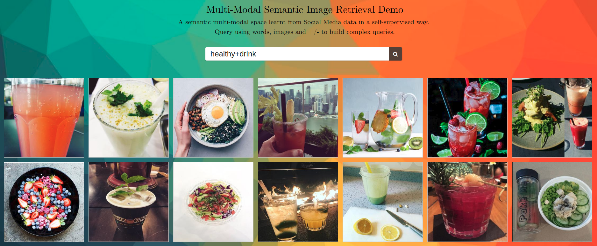

# Multi-Modal Semantic Image Retrieval Demo

**A joint multi-modal space for images and words with semantic structure has been learnt from Social Media data in a self-supervised way.
This demo lets explore that space, using words and images as queries, and allowing to perform arithmetics between them.**

**Find the running demo [here](https://gombru.github.io/MMSemanticRetrievalDemo/)!**



## Publications

This demo shows the work in the following publications. Read them to understand what is it showing.

**[Learning to Learn from Web Data through Deep Semantic Embeddings](https://arxiv.org/abs/1808.06368)**  
ECCV MULA workshop, 2018.
  
**[Self-Supervised Learning from Web Data for Multimodal Retrieval](https://arxiv.org/abs/1901.02004)**  
Book Chapter submitted to Multi-Modal Scene Understanding.

The work is also explained in a more informal way in this blog posts:  
**[Learning Image Topics from Instagram to Build an Image Retrieval System](https://gombru.github.io/2017/06/30/learning_from_instagram/)**  
**[What Do People Think about Barcelona?](https://gombru.github.io/2018/01/12/insta_barcelona/)**  
**[Learning to Learn from Web Data](https://gombru.github.io/2018/08/01/learning_from_web_data/)**  

## Demo configuration

This Demo uses **GloVe word embeddings**. The CNN to generate the image embeddings in the GloVe space has been trained with a **contrastive
loss**, using soft negative captions as negative samples. This **differs with the loss used in the papers, which was a Cross-Entropy Loss** to directly regress text embeddings. 
Contrastive loss has lead to significantly better results in later, not published yet, experiments.

The GloVe model and CNN used in this demo have been trained with the **[InstaCities1M dataset](https://gombru.github.io/2018/08/01/InstaCities1M/)**, so **expect a superior performance for queries related to Instagram typical posts and to cities featured in the dataset.** Go explore!

## Example queries you might try

#### Simple queries
america  
england  
sydney  
flag  
healthy  
happyness  
music  
eye  
hairstyle  
watch  
work  

#### Complex queries
people+park  
bike+park   
bike-park  
beach+sunrise  
beach-sunrise  
car+yellow  
car-yellow  
cold  
cold-snow  
train  
train-car  
paint  
travel+paint  
fish
fish+food

#### Multi-Modal queries
Retrieved images can be used as queries. Click an image to use it as a query.
Several images and words can be combined in a single query.

[IMG_1]+park  
[IMG_3]-dog  
[IMG_1]+[IMG_10]  

Sometimes, to get the desired output you might want to give more weight to a term in the query:

[IMG_1]+park+park+park


**This demo is based on the YOLO-PHOC_WebDemo by Lluis Gómez https://github.com/lluisgomez/YOLO-PHOC_WebDemo**


## Installation

### Install dependencies

This demo depends on [pywebsocket](https://github.com/google/pywebsocket/). Clone it with:

```
git clone https://github.com/google/pywebsocket.git
```

and follow the instructions in [README](https://github.com/google/pywebsocket/blob/master/README).

It also uses a C program to build PHOC descriptors of the query strings. The cphoc library must be compiled as follows:

```
cd MMSemanticRetrievalDemo/pywebsocket/cphoc/
gcc -c -fPIC `python-config --cflags` cphoc.c
gcc -shared -o cphoc.so cphoc.o `python-config --ldflags`
```

### Run the demo

Run the WebSocket standalone server:

```
cd MMSemanticRetrievalDemo/pywebsocket/
sudo python standalone.py -p 9998 -w ./
```
the server takes some time to initialize (loading the models and the image embeddings).


Open the index.html web interface in a HTML5 capable browser. E.g.:

```
cd MMSemanticRetrievalDemo/
google-chrome index.html
```
